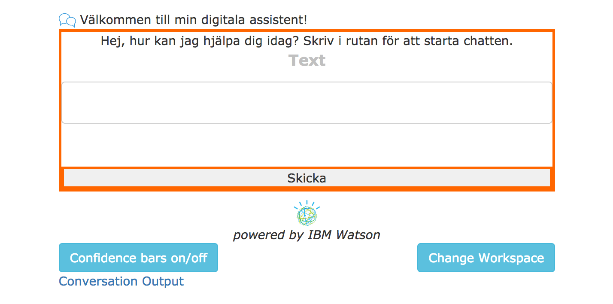
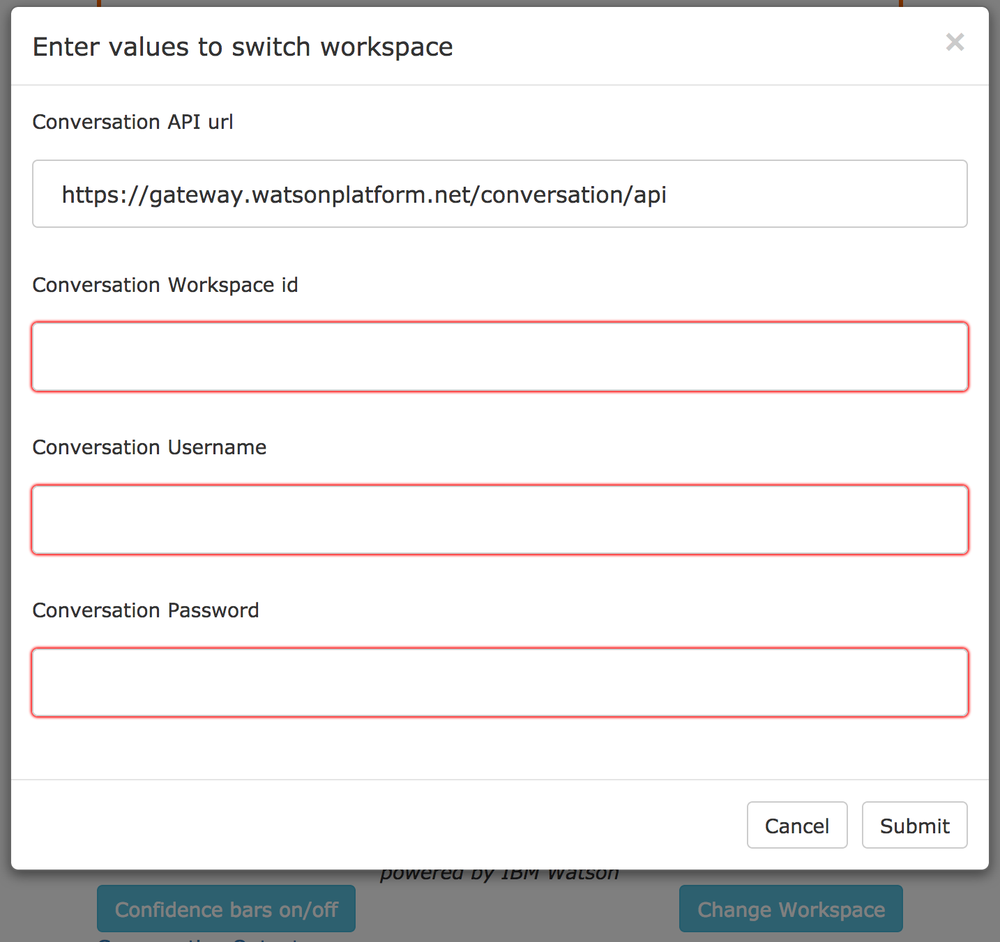
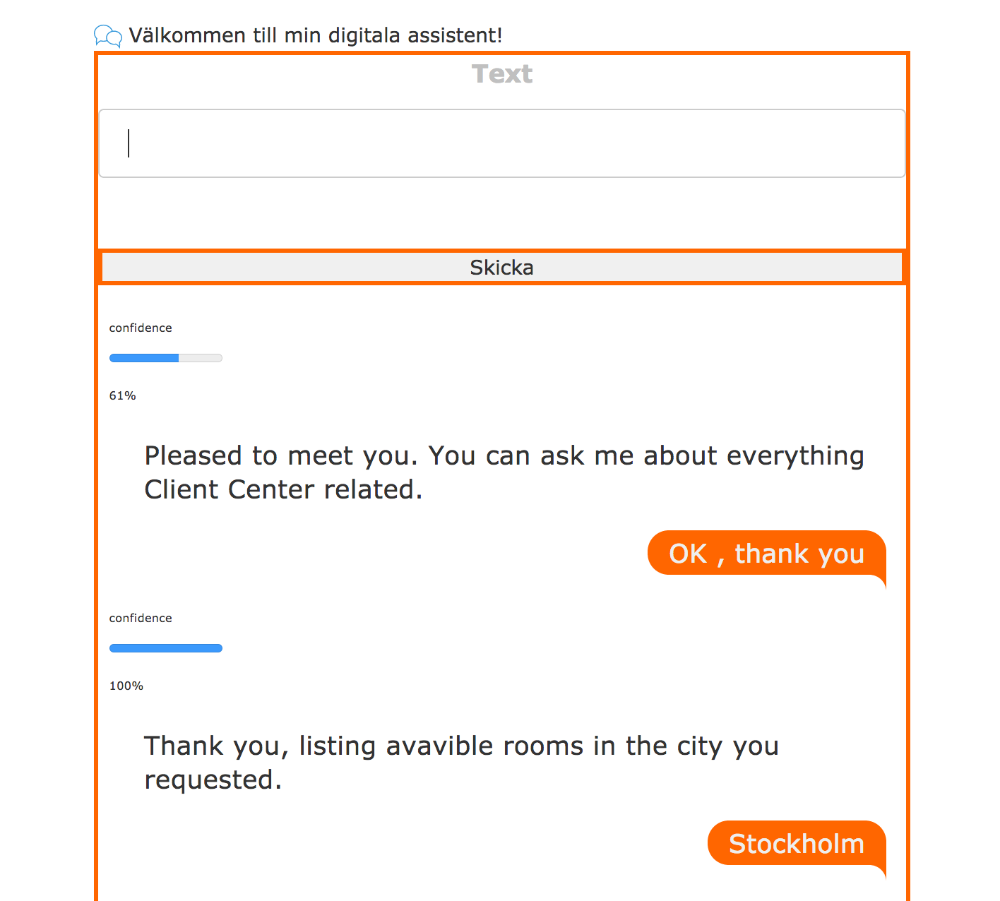

# Start developing a chat bot with Watson Conversation service

Demo application using the Watson Conversation API to send message to the conversation service.

## Overview

Built on Node.js runtime and an express server the application uses the Watson conversation api to run the application as a Cloud Foundry App on IBM Cloud. The front end is developed using HTML, CSS and Javascript (Angular). On startup, the application reads the user name and password (and watson api url) from the Watson service deployed in the same space in the IBM Cloud space (and organization). The Workspace id is read from an environment variable and can be changed without a full re-deploy (only restage on IBM Cloud or any other Cloud Foundry installation).

## Usage

Fork or clone the repository and deploy the app on IBM Cloud. Adjust the welcome message in index.html and colors in CSS to fit your needs. Once the app is upp and running change the conversation workspace with the "Change Workspace"-button.

The bot was developed using Swedish and some of the messages are still in the original language, but can easily be changed.

### Change workspace

### Toggle confidence scores

### View Conversation output

